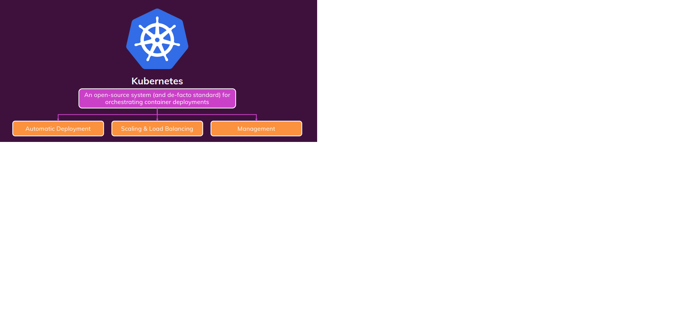
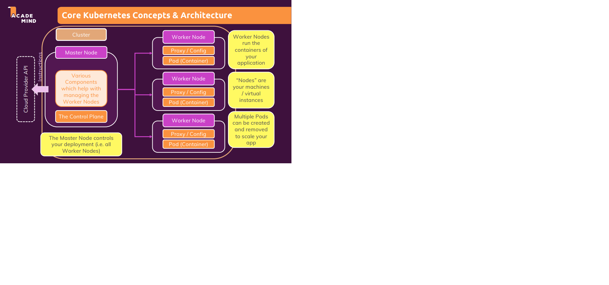
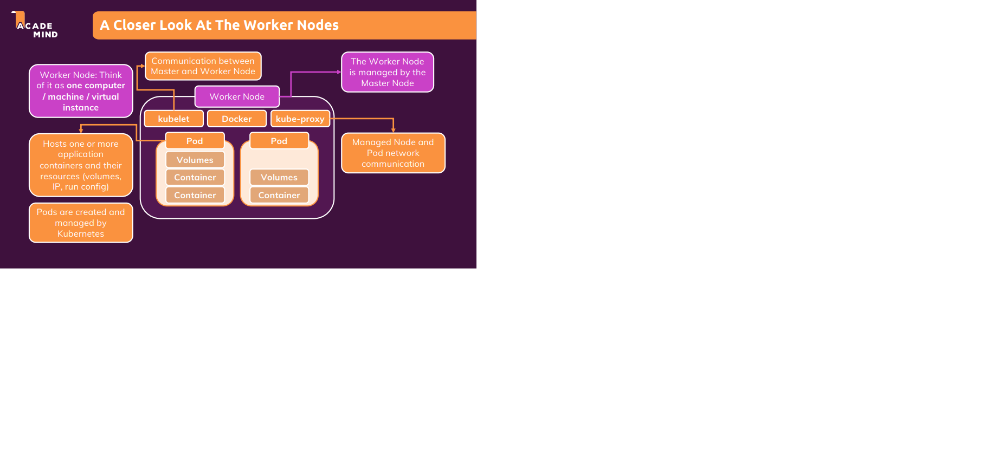
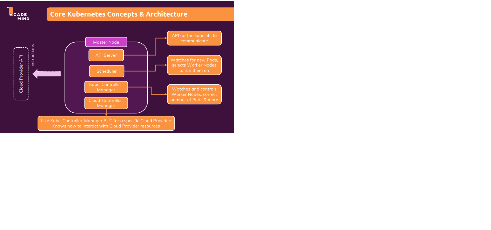
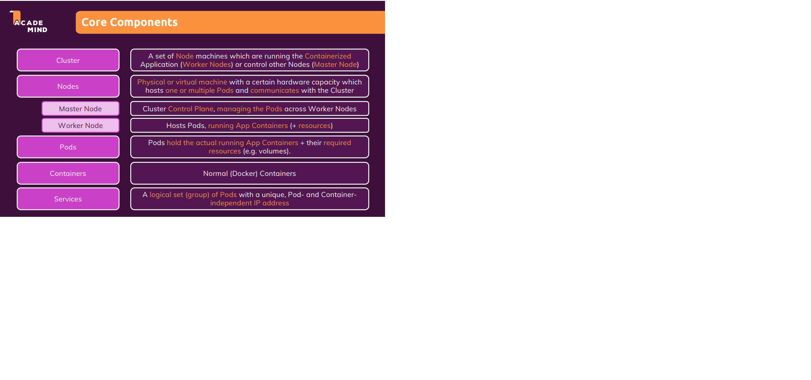

# DEPLOY YOUR APPLICATION TO KUBERNETES
  ### Why Kubernetes
  
  **Situation**
  Manually deployment have to manually monitoring the app, when we met upon traffic spikes - with real application, No way to manage a big application by manually, scale the number of running container, workload or traffic increases and decreases.
 
  **Kubernates**

 

  It is open souce system for Automatic deployment, Scaling & Load Balancing, Management for cross machines (containers)

**Kubernates configuration:** Independency config with machine => Any Clound Provider or Remote Machines which supports kubernates.

1. What Kubernetes IS and IS NOT
   - It's not a cloud service provider - It is open source project.
   - It's not a service by a cloud service provider - can be used with any provider
   - It's not restricted to any specific clound service provider  - It can be used with any provider.
   - It's not just a software you run on some machine => It's a collection of concepts and tools.
   - It's not an alternative to Docker => It work with docker containers
   - It's not a paid service => It's a free open source project

2. Using Kubernete
   Kubernete is like docker-compose for multiple machines.

## Core Kubernete Concept & Architecture - recheck in pactice parse
 ***Concept***
 It is open souce system for Automatic deployment, Scaling & Load Balancing, Management for cross machines (containers)

 **Architecture**

 

Basic idea: In Cluster will have a master node  - the master node will manage the worker node

 WORKER NOTE contains Pod(container) and proxy config  
 Workder Nodes run the containers of your application.
 "Nodes" are your machines/virtual instances.
 ALL of them above is a cluster.

**So that mean our job when setup the Kubernates**
**What need to do/setup** : 
 - Create Cluster and the Node Instances (Worker + Master Nodes)
 - Setup API server, kubelet and other Kubernetes services/sofware on Nodes
 - Create other (cloud) providers resource that might be needed (Load Balancer, File systems)

**What Kubernates Will Do**
 - Create your objects (e.g Pods) and managee them
 - Monitor Pods and re-create them, scale Pods etc
 - Kubernetes utilizes the provided (cloud) resources to apply your configuration/goals

### Take a closer looking at WORKER NODE

- **Worker Node** it as one computer/machine/vitural instance 
- **Worker Node** is managed by the Master Node.
- **Worker Node** have Pod inside
- **Pod** hosts one or more application containers and their resources(volumes, container, IP, run config) and Pod are created and managed by Kubernetes
- You can create one more Pod with same of different containers.
- **Docker** is setted up inside of Worker Node
- **Kubelet** is setted up inside of Worker Node to communicate between Master and Worker Node
- **kube-proxy** is setted up inside of Worker Node to managed Node and Pod network communication

### Take a closer looking at MASTER NODE

- API server: API for the kubelets to communicate
- Scheduler: Watches for new Pods, selects worker Nodes to run them on
- Kube-Controller Manager: watches and controls Worker Nodes, correct number of Pods & more
- Cloud-Controller Manager: Like Kuber-Controller-Manager but for a specific Cloud Provider Knows how to interact with Cloud Provider resource

### Core component

- **Cluster** : A set of Node machines which are running the Containerized  Application (Worker Node) or contol other Nodes (Master Node) **|** a network of machines which are plit up in Worker and Master Nodes
- **Nodes** :  Physical or virtual machine with a certain hardware capacity which hosts one or multiple Pods and communicates with Cluster
 - **Master Node** : Cluster Control Plane, managing the Pods across Worker Node
 - **Worker Node** : hosts Prods, running App Containers( + resources)
 - **Pods**: A "shell" for a Container -  Pods hold the actual running App Containers + their required resources(e.g volumes)
- **Containers**: Nomal docker containers
- **Services**: A logical set (group) of Pods with a unique, Pod- and Container- independent IP address

